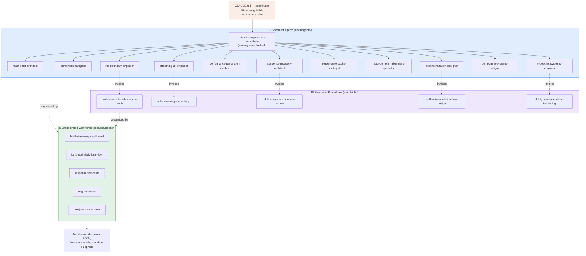

# RSC Forge


> An AI React Staff Engineer — not a code generator.

RSC Forge is a **Claude Code operating model**: a `CLAUDE.md` constitution plus a structured library of 12 agent personas, 15 execution-procedure skills, 5 multi-phase playbooks, 6 architecture reference docs, and 5 fill-in-the-blank templates that together make Claude reason like a principal React engineer — about server/client boundaries, streaming, Suspense, mutation lifecycles, TypeScript contracts, and perceived performance — **before** it writes a line of code.

---

## Table of Contents

- [What this repository actually is](#what-this-repository-actually-is)
- [Overview](#overview)
- [Mental Model](#mental-model)
- [Repository Structure](#repository-structure)
- [Core Concepts / Deep Dive](#core-concepts--deep-dive)
  - [The constitution — `CLAUDE.md`](#the-constitution--claudemd)
  - [Agents — stable identities, not prompts](#agents--stable-identities-not-prompts)
  - [Skills — reusable execution procedures](#skills--reusable-execution-procedures)
  - [Playbooks — orchestrated multi-agent workflows](#playbooks--orchestrated-multi-agent-workflows)
  - [Architecture docs and templates](#architecture-docs-and-templates)
- [The 10 non-negotiable architecture rules](#the-10-non-negotiable-architecture-rules)
- [Getting Started](#getting-started)
- [Standard Workflows](#standard-workflows)
- [Framework Target](#framework-target)
- [Further Reading / Related Repos](#further-reading--related-repos)

---

## What this repository actually is

This is **not** a React application. There is no `package.json`, no `src/`, no build tooling, and no `app/` directory checked in yet — the system overview in this README describes `app/` as *"your React application"*, i.e. a placeholder for wherever this operating model is dropped into an actual codebase. What this repository contains, in full, is Markdown: one constitution file (`CLAUDE.md`), and 43 supporting documents under `docs/` that define agent personas, executable skills, playbooks, architecture positions, and output templates for Claude Code to follow when it *does* work on a real React 2026 project.

If you came here expecting hooks or components, see [`_ReactHooks`](https://github.com/CristianSifuentes/_ReactHooks) or [`React-Advanced-Patterns-Performance`](https://github.com/CristianSifuentes/React-Advanced-Patterns-Performance) instead. This repo is the *thinking layer* that sits in front of writing that code.

## Overview

RSC Forge's core promise, stated in its own README:

> "An AI React architect that thinks in server/client boundaries, streaming, Suspense, mutations, contracts, and perceived performance." Not: *"An AI that knows React."* But: *"A React Staff Engineer you can talk to."*

Every output the system is designed to produce touches six concerns: server/client boundary classification, streaming and reveal-order design, Suspense/error boundary placement, full mutation lifecycle design (`pending → optimistic → success → error → rollback`), cross-layer TypeScript contracts, and perceived performance — what users *feel*, not just what a Lighthouse score reports.

## Mental Model

Claude Code composes three layers of abstraction. **Agents** are stable personas that make decisions; **skills** are step-by-step procedures an agent (or Claude directly) executes; **playbooks** sequence multiple agents and skills into an end-to-end workflow for a common task. `CLAUDE.md` is the constitution that binds all of them to the same 10 architecture rules.



The key architectural idea: **agents own judgment, skills own procedure, playbooks own sequencing.** No single monolithic prompt tries to do everything — each specialist has a narrow mission and a defined output format, and playbooks compose them for the workflows that show up repeatedly in real React engineering (new feature, code review, legacy migration).

## Repository Structure

```txt
agentReact-/
├─ CLAUDE.md                              # System constitution & 10 architecture rules
├─ LICENSE                                # Apache 2.0
├─ README.md
└─ docs/
   ├─ agents/                             # 12 specialist personas (identity, mission, output format)
   │  ├─ ai-pair-programmer-orchestrator.md
   │  ├─ react-chief-architect.md
   │  ├─ rsc-boundary-engineer.md
   │  ├─ streaming-ux-engineer.md
   │  ├─ suspense-recovery-architect.md
   │  ├─ actions-mutation-designer.md
   │  ├─ react-compiler-alignment-specialist.md
   │  ├─ typescript-systems-engineer.md
   │  ├─ server-state-cache-strategist.md
   │  ├─ framework-navigator.md
   │  ├─ component-systems-designer.md
   │  └─ performance-perception-analyst.md
   ├─ skills/                             # 15 reusable execution procedures
   │  ├─ skill-server-client-boundary-audit.md
   │  ├─ skill-streaming-route-design.md
   │  ├─ skill-suspense-boundary-planner.md
   │  ├─ skill-error-boundary-containment-plan.md
   │  ├─ skill-action-mutation-flow-design.md
   │  ├─ skill-optimistic-ui-strategy.md
   │  ├─ skill-compiler-friendly-refactor.md
   │  ├─ skill-selective-state-placement.md
   │  ├─ skill-typescript-contract-hardening.md
   │  ├─ skill-framework-translation.md
   │  ├─ skill-component-api-review.md
   │  ├─ skill-perceived-performance-audit.md
   │  ├─ skill-react-2026-feature-scaffolder.md
   │  ├─ skill-adr-writer.md
   │  └─ skill-ai-teaching-mode.md
   ├─ playbooks/                          # 5 multi-phase, multi-agent workflows
   │  ├─ build-streaming-dashboard.md
   │  ├─ build-optimistic-form-flow.md
   │  ├─ suspense-first-route.md
   │  ├─ migrate-to-rsc.md
   │  └─ nextjs-vs-react-router.md
   ├─ architecture/                       # 6 canonical position papers
   │  ├─ react-2026-principles.md
   │  ├─ server-client-boundaries.md
   │  ├─ state-strategy.md
   │  ├─ suspense-error-architecture.md
   │  ├─ performance-strategy.md
   │  └─ framework-decisions.md
   └─ templates/                          # 5 fill-in-the-blank output formats
      ├─ adr-template.md
      ├─ feature-proposal-template.md
      ├─ route-design-template.md
      ├─ suspense-map-template.md
      └─ performance-audit-template.md
```

43 Markdown files, ~4,500 lines total, organized in a strict four-tier hierarchy: constitution → agents → skills → playbooks, with architecture docs and templates as shared reference material.

## Core Concepts / Deep Dive

### The constitution — `CLAUDE.md`

[`CLAUDE.md`](CLAUDE.md) is what Claude Code reads first. It restates the system's core promise, lists the full agent and skill roster in table form, and — critically — encodes the same 10 architecture rules that every agent document references, so no agent can silently drift from the house style. It also defines the three standard workflows (new feature, code review, migration) at a high level, which the `docs/playbooks/` files then expand into step-by-step guides.

### Agents — stable identities, not prompts

Each file in [`docs/agents/`](docs/agents/) follows the same shape, illustrated by [`react-chief-architect.md`](docs/agents/react-chief-architect.md):

```markdown
# Agent: React Chief Architect

## Identity
You are a React 2026 principal architect. You own the overall shape of a
React application ... You think in systems, not components.

## Mission
## Core specializations
## Questions this agent answers
## Key decisions this agent produces
## Output format
## Architecture principles enforced
```

This is a deliberate design choice: every agent has a fixed **identity** (how it thinks), a **mission** (what it owns), and a structured **output format** — not a loose instruction. That structure is what lets the orchestrator hand off work between agents predictably. The 12 agents are grouped into four functional clusters:

| Cluster | Agents |
|---|---|
| Orchestration | `ai-pair-programmer-orchestrator` |
| Architecture & Boundaries | `react-chief-architect`, `rsc-boundary-engineer`, `framework-navigator` |
| Streaming & Resilience | `streaming-ux-engineer`, `suspense-recovery-architect`, `performance-perception-analyst` |
| Mutations & State | `actions-mutation-designer`, `server-state-cache-strategist` |
| Quality & Systems | `react-compiler-alignment-specialist`, `typescript-systems-engineer`, `component-systems-designer` |

### Skills — reusable execution procedures

Where an agent is a persona, a [skill](docs/skills/) is a callable procedure with a defined purpose, execution steps, and quality checklist — e.g. `skill-action-mutation-flow-design` models the full `IDLE → PENDING → OPTIMISTIC → SUCCESS → ERROR → ROLLBACK` lifecycle for a mutation, and `skill-compiler-friendly-refactor` strips out unjustified `useMemo`/`useCallback`/`React.memo` to restore component purity ahead of the React Compiler. Skills are grouped by concern: boundary classification, streaming/resilience, mutations/optimism, code quality, TypeScript contracts, framework translation, and scaffolding/documentation.

### Playbooks — orchestrated multi-agent workflows

[`docs/playbooks/`](docs/playbooks/) sequences agents and skills for the workflows that recur constantly in React engineering. For example, [`build-streaming-dashboard.md`](docs/playbooks/build-streaming-dashboard.md) runs:

```
chief-architect → streaming-ux → suspense-recovery → server-state → ts-engineer → performance-analyst
```

and [`migrate-to-rsc.md`](docs/playbooks/migrate-to-rsc.md) — for moving a legacy `useEffect + fetch` app to Server Components — runs `rsc-boundary → server-state → compiler-alignment → framework-navigator`. Each playbook file (129–188 lines) spells out the phase-by-phase intent, not just the agent order.

### Architecture docs and templates

[`docs/architecture/`](docs/architecture/) holds the system's canonical positions — e.g. [`state-strategy.md`](docs/architecture/state-strategy.md) defines the state classification system (local / derived / server / cached / optimistic / URL / form) referenced by rule 7 of the constitution, and [`framework-decisions.md`](docs/architecture/framework-decisions.md) is a capability map for choosing between Next.js App Router and React Router 7. [`docs/templates/`](docs/templates/) provides fill-in-the-blank formats — ADRs, feature proposals, route designs, Suspense maps, performance audits — so agent output is consistently structured and diffable across reviews.

## The 10 non-negotiable architecture rules

Every agent, skill, and playbook in this system is bound by the same rules, defined once in `CLAUDE.md` and restated in the README:

| # | Rule |
|---|---|
| 1 | Server Components by default. Justify every `'use client'`. |
| 2 | Data belongs on the server. No `useEffect + fetch` for data that can be server-fetched. |
| 3 | Suspense boundaries are intentional architecture. Every boundary needs a fallback rationale. |
| 4 | Optimize perceived speed first. Users feel reveal order, not milliseconds. |
| 5 | No cargo-cult memoization. Never add `useMemo`/`useCallback` without profiling evidence. |
| 6 | Keep client bundles small and explicit. Every `'use client'` is a hydration cost. |
| 7 | Make state ownership visible. Classify before you store. |
| 8 | Types are contracts. Align types across server, actions, and UI. No `any`. |
| 9 | Mutations have full lifecycles. Design `IDLE → PENDING → SUCCESS → ERROR → ROLLBACK`. |
| 10 | Framework conventions first. Lean on Next.js App Router or React Router 7 before inventing abstractions. |

## Getting Started

There is no build step — this repository is consumed by pointing Claude Code at it:

1. Clone or vendor this repository alongside (or inside) the React codebase you want Claude Code to operate on.
2. Ensure `CLAUDE.md` is discoverable by Claude Code (project root, or wherever your Claude Code configuration expects the operating-model file).
3. Reference an agent or playbook directly in your prompt, e.g. *"Use react-chief-architect to design the boundary strategy for this feature"* or *"Run the build-streaming-dashboard playbook."*
4. For a new feature end-to-end, follow the [New feature request](#standard-workflows) sequence below; Claude Code will route through the relevant specialists automatically if the orchestrator agent is engaged first.

## Standard Workflows

**New feature request**
```
1. ai-pair-programmer-orchestrator   → decompose the task
2. react-chief-architect             → architecture & boundaries
3. framework-navigator               → map to Next.js or React Router 7
4. rsc-boundary-engineer             → classify server/client placement
5. actions-mutation-designer         → design mutations & interactions
6. suspense-recovery-architect       → loading/error containment
7. typescript-systems-engineer       → harden types & contracts
8. performance-perception-analyst    → verify perceived speed
9. component-systems-designer        → clean reusable APIs
```

**Code review** — run independently against an existing route or feature: `review:rsc-boundaries`, `review:suspense-architecture`, `review:compiler-alignment`, `review:state-ownership`, `review:perceived-performance`.

**Migration to modern React** — `react-chief-architect → rsc-boundary-engineer → server-state-cache-strategist → react-compiler-alignment-specialist → framework-navigator → performance-perception-analyst`, backed by the [migrate-to-rsc](docs/playbooks/migrate-to-rsc.md) playbook.

## Framework Target

| Phase | Framework | Status |
|---|---|---|
| V1 | Next.js App Router | Primary — deepest RSC support |
| V2 | React Router 7 | Comparison & translation mode |

Side-by-side implementations for both are produced by the [Framework Navigator](docs/agents/framework-navigator.md) agent together with [skill-framework-translation](docs/skills/skill-framework-translation.md).

## Further Reading / Related Repos

Part of a series of focused React 2026 repositories by [Cristian Sifuentes](https://github.com/CristianSifuentes). RSC Forge is the architecture/reasoning layer; the pattern and hooks repos below are where the resulting decisions get implemented in code:

- [React-Advanced-Patterns-Performance](https://github.com/CristianSifuentes/React-Advanced-Patterns-Performance) — compound components, render props, `useTransition`/`useDeferredValue`
- [_ReactHooks](https://github.com/CristianSifuentes/_ReactHooks) — built-in hooks taxonomy
- [ACHooks](https://github.com/CristianSifuentes/ACHooks)
- [CRUP](https://github.com/CristianSifuentes/CRUP)
- [POptimizationCodeSplitting-](https://github.com/CristianSifuentes/POptimizationCodeSplitting-)
- [RCP](https://github.com/CristianSifuentes/RCP)
- [ILGState-](https://github.com/CristianSifuentes/ILGState-)
- [ATypeScript](https://github.com/CristianSifuentes/ATypeScript)
- [SAPatterns](https://github.com/CristianSifuentes/SAPatterns)
- [tsconfig_](https://github.com/CristianSifuentes/tsconfig_)
- [rxt-mastery_](https://github.com/CristianSifuentes/rxt-mastery_)
- [React-State-Data-Management](https://github.com/CristianSifuentes/React-State-Data-Management)
- [Architectural-Server-Side-Paradigms](https://github.com/CristianSifuentes/Architectural-Server-Side-Paradigms)
- [React-Essential-2026-Skills](https://github.com/CristianSifuentes/React-Essential-2026-Skills)
- [_PropDrillingReact](https://github.com/CristianSifuentes/_PropDrillingReact)
- [ReactAdvancedConceptsStudio_](https://github.com/CristianSifuentes/ReactAdvancedConceptsStudio_)

## License

Apache License 2.0 — see [LICENSE](LICENSE).
